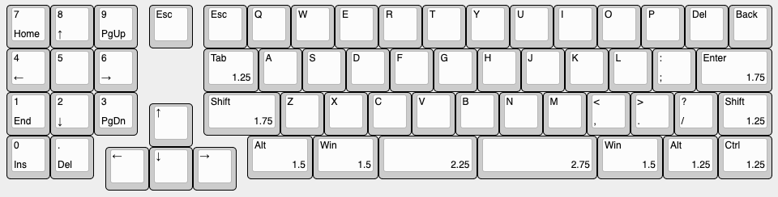

# Reverie

The reverie is a hot swap mini 1800 inspired by the [Elongate](https://geekhack.org/index.php?topic=106527), [Clarabelle](https://geekhack.org/index.php?topic=106380.0), and [Garbage Truck](https://www.reddit.com/r/MechanicalKeyboards/comments/gkb4nt/the_garbage_truck/) keyboards.
I made this because hot swap is usually left out in smaller runs of high end coustoms.

The plate file can be found in the [docs](./docs) folder.

## Wiring Guide

The following diagram displays the colums and rows.

